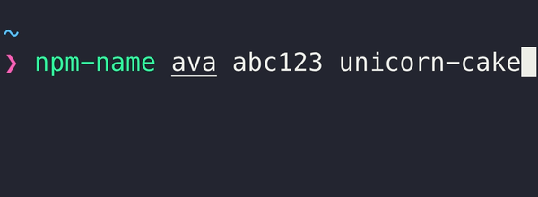

# npm-name-cli

> Check whether a package or organization name is available on npm



*Feedback about the squatter detection should be opened on the [`squatter`](https://github.com/sholladay/squatter) repo.*

## Install

```sh
npm install --global npm-name-cli
```

## Usage

```
$ npm-name --help

  Usage
    $ npm-name <name> …

  Examples
    $ npm-name chalk
    ✖ chalk is unavailable

    $ npm-name abc123
    ⚠ abc123 is squatted

    $ npm-name hello --similar
    ⚠ hello is squatted
    Similar names:
    ✔ hullo is available
    ✔ how-do-you-do is available

    $ npm-name unicorn-cake
    ✔ unicorn-cake is available

    $ npm-name @ava
    ✖ @ava is unavailable

    $ npm-name @abc123
    ✔ @abc123 is available

    $ npm-name @sindresorhus/is unicorn-cake
    ✖ @sindresorhus/is is unavailable
    ✔ unicorn-cake is available

  Exits with code 0 when all names are available or 2 when any names are taken
```

## FAQ

### Why would I use `npm-name` rather than npm's built-in search?

1. Nicer & simpler output

2. [Squatter detection](https://github.com/sholladay/squatter)

3. Supports checking the availability of organization names

4. Suggest other similar names if not available

5. Performance

  Using npm 4.0.2

  ```
  $ time npm search unicorn-cake
  No matches found for "unicorn-cake"
  npm search unicorn-cake  55.50s user 0.82s system 101% cpu 55.380 total
  $ time npm-name unicorn-cake
  ✔ unicorn-cake is available
  npm-name unicorn-cake  0.17s user 0.02s system 35% cpu 0.535 total
  ```

## Related

- [npm-name](https://github.com/sindresorhus/npm-name) - API for this module
